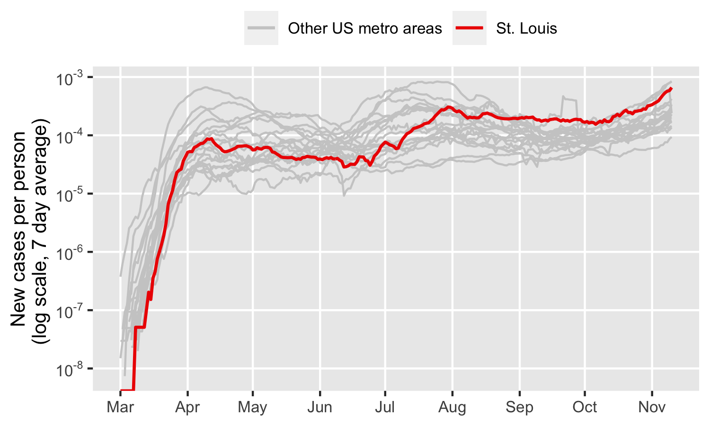
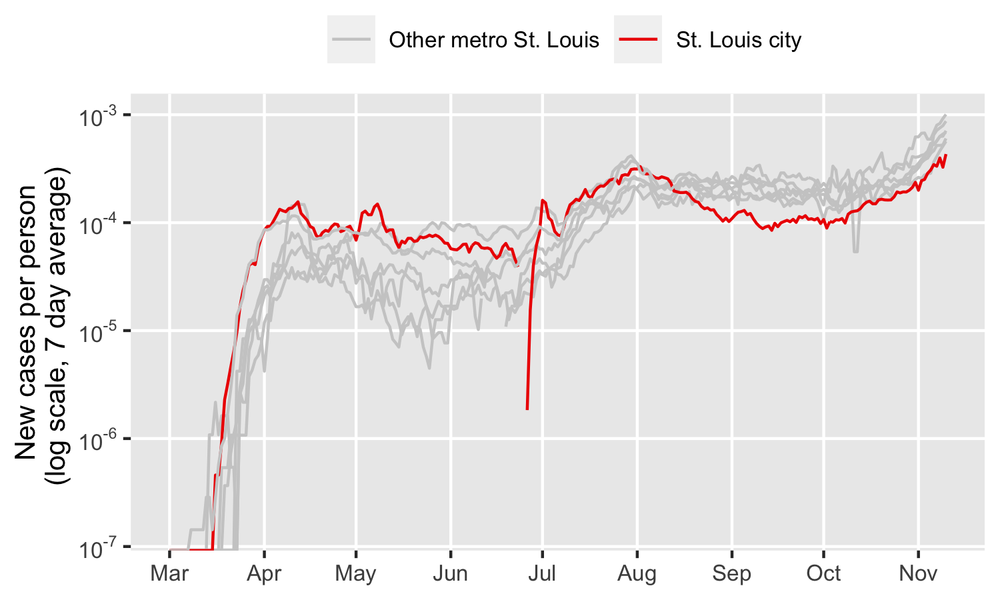
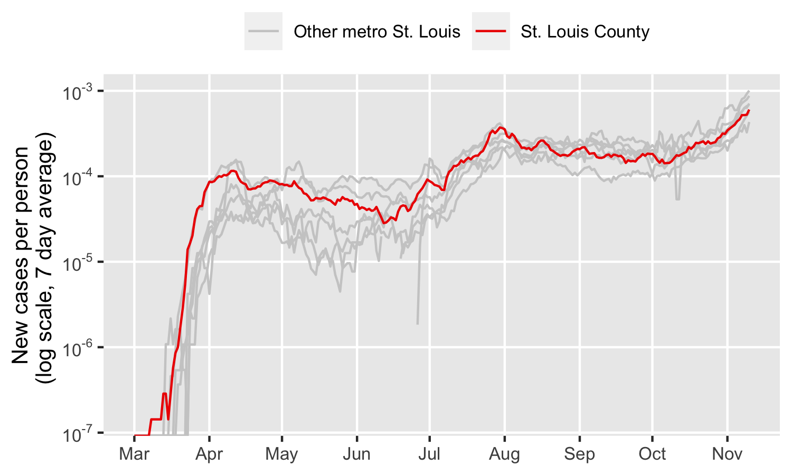
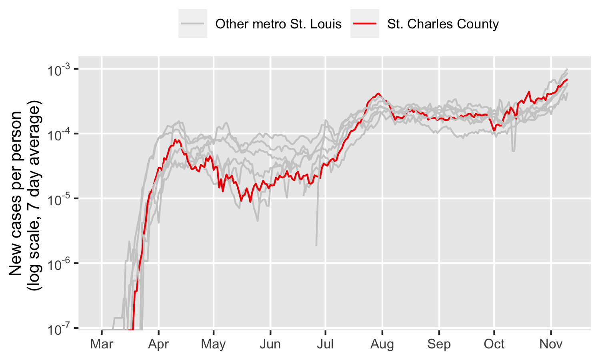
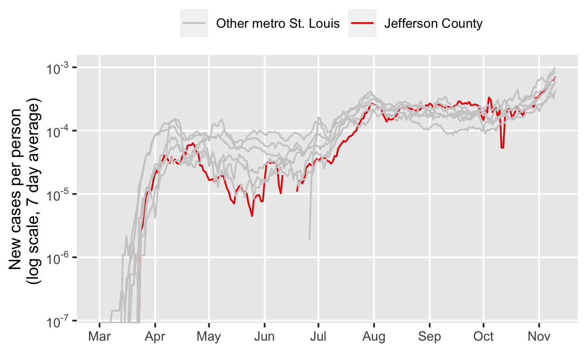
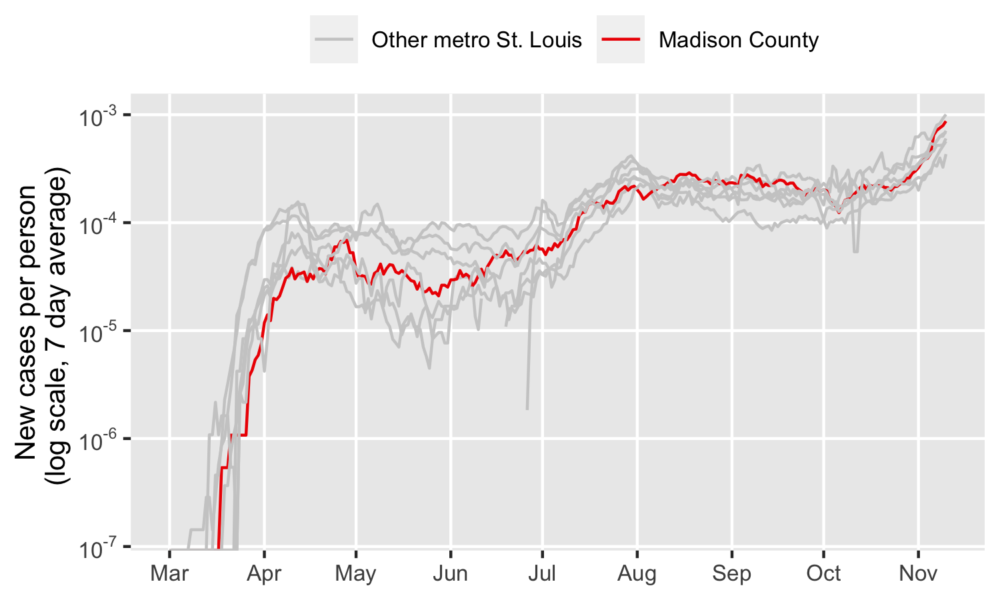
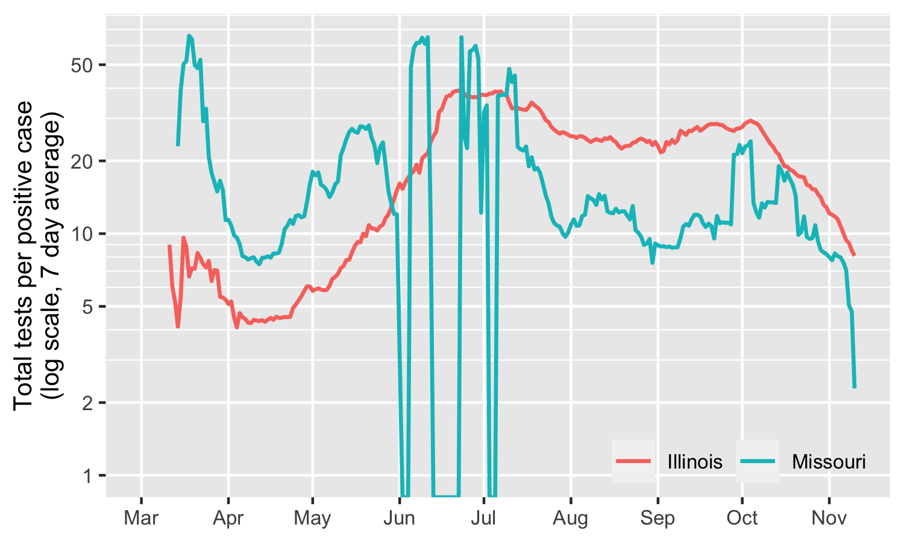
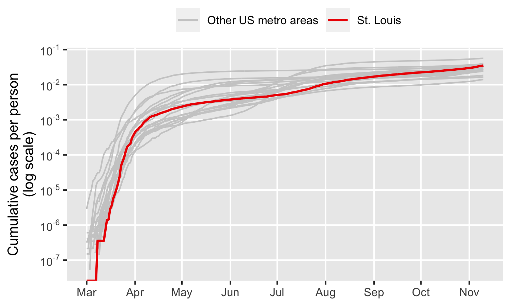

Department of Biology, University of Missouri--St. Louis

Latest update: `r Sys.Date()`

***

## Introduction

We are developing graphical tools, real-time metrics, and statistical analyses to better monitor local outbreaks of the SARS-CoV-2 virus that causes COVID-19. Epidemiological population dynamics can be complicated and unintuitive, and conventional case reporting often fails to capture more than the gross outlines of outbreak behavior. As research microbiologists, we want to look at data and see more than a curve that goes up. Mathematical models are useful tools, but it can be difficult to assess what assumptions they make, how reasonable those assumptions are, an how well they capture the behavior of real outbreaks. Models are no substitute for data. 

```{r echo = FALSE}
# * microbial perspective
# * data focused, model informed
# * dynamics, not snapshots
# * worry about data quality
# * think global, act local
```

***

## New cases

The number of new reported COVID-19 cases lets us estimate how prevalent the SARS-CoV-2 virus is: 

{width=75%}

We're plotting new cases on a [logarithmic scale](https://en.wikipedia.org/wiki/Logarithmic_scale) so we can better see the whole path of the outbreak and better compare different areas. It also makes sense biologically because infectious transmission is an exponential process. When one infected person infects two more people, and they go on to each infect two more people, "twice as many cases" might only be a few days' difference. And we're plotting cases per person because it lets us properly compare how prevalent the virus is in different areas, no matter how populous they might be. In a sense, humans have become the main "habitat" for SARS-CoV-2. 

Plots like these are often dominated by what's going on in places with the most people, so it's useful to examine smaller sub-areas individually: 

### {.tabset}

#### St. Louis City

{width=75%}

#### St. Louis County

{width=75%}

#### St. Clair County

{width=75%}

#### St. Charles County

{width=75%}

#### Jefferson County

{width=75%}

#### Madison County

{width=75%}

#### Monroe County

{width=75%}

### {-}

***

## Testing effort

The total number of people infected with SARS-CoV-2 is likely higher than the number of reported cases. Some people can be infected yet show few to no symptoms. People who do have symptoms might not try to get tested for the virus, and people who try to get tested may not be able to. Testing effort can also be different in different places and can change over time. In the early days of the pandemic, reported cases in the United States rose not only because the virus was spreading, but also because we were testing for it more. So the number of reported cases is a somewhat messy indicator of infection prevalence. 

```{r echo = FALSE} 
# Some estimates put the undercount rate at ...
``` 
One way to assess how much we're undercounting actual infections is to compare how many tests come back positive and how many come back negative. When testing capabilities are limited, doctors and nurses save tests for people most likely to be infected. When tests are more freely available, public health officers can test more people who might have been infected to track down the virus and keep it from spreading further (called contact tracing). 

{width=75%}

***

## Total cases so far

Pandemics typically end when enough people gain protective immunity, either by getting infected and recovering or by being vaccinated. When there aren't enough susceptible people around, and each infected person goes on to infect less that one new person, the outbreak starts fizzling out (sometimes called [herd immunity](https://en.wikipedia.org/wiki/Herd_immunity)). For COVID-19, that would require around 50-66% of all people have protective immunity. 

The best way to measure how many people have protective immunity is to measure their immune response. We don't have good data for that yet with COVID-19, but we can look at the total number of people who have been infected so far (remembering that many infections go unreported). 

{width=75%}


***

## About us

This project is a collaboration between jeff smith, Ph.D. and [R. Fredrik Inglis](https://inglislab.umsl.edu/), Ph.D. in the Department of Biology at University of Missouri-St. Louis. We are research microbiologists studying microbial ecology and evolution. 

Our reported case data comes from the [Johns Hopkins Center for Systems Science and Engineering](https://github.com/CSSEGISandData/COVID-19) and our testing data comes from [The Covid Tracking Project](https://covidtracking.com). All of our code is available on [Github](https://github.com/matryoshkev/arch-covid). 

```{r echo = FALSE}
## More resources

# .. prener site and other official sources
# .. stl city, stl county, state MO, state IL
# .. CDC

## References
```

